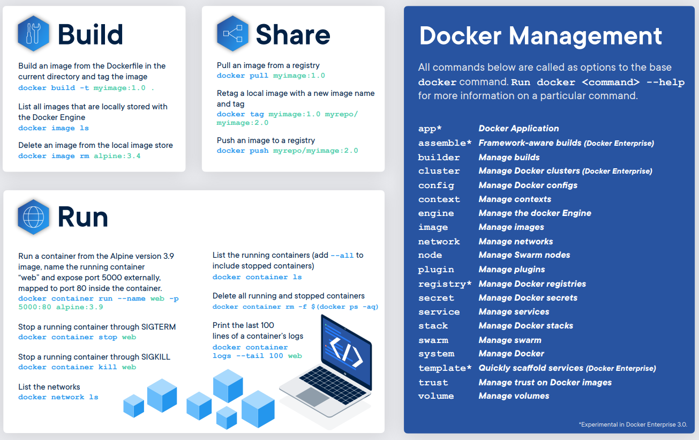

<!-- class: invert -->

# Docker-Guide
Um gia prático e bem resumido do Docker para iniciantes. Para mais informações consulte a [documentação do Docker](https://docs.docker.com/engine/).\
Esse conteúdo é um resumo do que foi aprendido no curso de Desenvolvimento Web na [Trybe](https://www.betrybe.com/).

---
# Sumário

- [O que é o Docker e qual problema ele se dispõe a resolver?](#introdução)
- [O que é um container e uma imagem no Docker?](#container-e-imagem)
- [Instalando e configurando o Docker Engine](#fazendo-a-instala%C3%A7%C3%A3o-do-docker-engine)
  - [Instalando o Docker Engine](#instalando-docker-engine)
- [Principais comandos do Docker](#principais-comandos-do-docker);

---
# Introdução

Existem milhares de Sistemas Operacionais (S.O), distros, frameworks, ect, no mundo. Ao desenvolver uma aplicação usando uma ferramenta é muito difícil garantir que o que funciona na máquina de uma pessoa funcionará na máquina de outra sem a necessidade de fazer novas configurações.

O Docker é uma ferramente que permite empacotar aplicações para rodá-las em qualquer S.O, distro ou servidor sem precisar fazer novas configurações. Portanto, por meio do Docker, resolvemos o problema de incompatibilidade com outros sistemas, dado que ele funciona como uma espécie de "empacotador" de todas essas dependências e requisitos para que sua aplicação funcione sem problemas!

---
# Container e imagem

O `container` é um processo Docker que, internamente, possui tudo aquilo que é necessário para seu funcionamento: Sistema Operacional (Binários e Bibliotecas) e recursos necessários para sua aplicação;

A `imagem` é uma espécie de "fotografia" de um container , nós resgatamos uma imagem, quando queremos iniciar um novo container a partir de uma estrutura já conhecida.

---
## Containers

De certa forma o container lembra muito - _mas não é_ - uma maquina virtual. Dentro dele está empacotado tudo que é preciso para aplicação rodar e quando execultado ele ultiliza os recursos da própria máquina hospedeira para virtualizar a aplicação.

---
## Imagens

Imagens podem se referir a praticamente qualquer tipo de container . Um exemplo disso é pensar o próprio sistema operacional Ubuntu, que possui [uma imagem oficial no Docker Hub](https://hub.docker.com/_/ubuntu).

O [Docker Hub](https://hub.docker.com/) é o principal repositório de imagens Docker atualmente. Nele, possuímos o que é chamado de [Registro](https://docs.docker.com/registry/introduction/) _(Registry)*_ , onde requisitamos essas imagens.

> _**O Registry** * é um sistema de armazenamento e entrega, no qual podemos ter um usuário com nossas próprias imagens. Algo que lembra muito o GitHub, já que podemos dar pull nessas imagens para uso posterior_.

----
## Fluxo padrão

Para explicar melhor a dinâmica entre containers e imagens, falaremos um pouco de como funciona o fluxo padrão do Docker :

---


---
Após isso, podemos dar push ou pull (como em um repositório do GitHub) em uma imagem no Registry *;
* Você pode dar pull na sua própria imagem (caso tenha dado push nela) ou em outra a sua escolha, como foi o caso do hello-world ).
O Registro mais comum é o Docker Hub , mas temos outros exemplos, como mostrado na imagem.
Por último, rodamos a imagem em um container , utilizando o comando run , que veremos mais adiante *.
* Após isso, temos que dizer pro container o que deve acontecer, se ele deve se manter ativo ou não, caso o contrário, o container é encerrado. O que faz parte de seu ciclo de vida.

---

**`Dockerfile`** - Tudo começa aqui. Este arquivo possui as _instruções_* necessárias para que possamos gerar uma imagem;

<br/>

> _**Instruções** * : São as instruções de qual sistema operacional usar, tal como quais comandos devem ser executados quando a imagem for rodada em um container . Após isso, podemos dar push ou pull (como em um repositório do GitHub) em uma imagem no Registry. O Registro mais comum é o Docker Hub , mas temos outros exemplos, como mostrado na imagem._

<br/>

**`image`** - É a compilação que é gerada pelo dockerfile após o build. Essa imagem é carregada num registro na nuvem como o Docker Hub. O comando `run` faz com que essa imagem como S.O e todas as confit

**`container`** - 

Containers lembram muito - mas não são - máquinas virtuais, já que podemos rodar uma aplicação Linux em qualquer ambiente (Windows, Mac ou no próprio Linux) através dele.

---

# Fazendo a instalação do Docker Engine

> Para ir direto para a instalação do Docker Engine clique [aqui](#instalando-docker-engine)

## Desinstalando versões anteriores

Caso você já possua alguma versão instalada na sua máquina e queira refazer o processo de instalação desde o princípio por qualquer motivo, seja pra atualizar ou para corrigir algum problema, primeiro você deve remover os pacotes da versão que está na sua máquina. Para isso, utilize o seguinte comando no terminal

```
sudo apt-get remove docker* containerd runc
```
Caso nenhum dos pacotes esteja instalado, esse comando retornará um erro `E: Impossível encontrar o <nome-do-pacote>` , nesse caso, é só prosseguir com a instalação.

---

Para remover completamente o Docker Engine use:

```
sudo apt-get purge docker-ce docker-ce-cli containerd.io
```
Para remover containers , volumes (que veremos nas próximas aulas) e configurações personalizadas que não são removidas automaticamente pelo apt-get , utilize os seguintes comandos:

```
sudo rm -rf /var/lib/docker
sudo rm -rf /var/lib/containerd
```

---

## Atualizando os pacotes apt

> Na documentação de instalação do Docker no Ubuntu, é comentado que existem três formas de instalar o Docker : via repositórios, via pacotes .deb e via scripts específicos.
> No nosso contexto, faremos a instalação via configuração de repositórios, pois isso facilita posteriormente a atualização desses mesmos pacotes.

```
sudo apt install update; sudo apt install upgrade -y
```

## Habilitando HTTPS para o apt

```
sudo apt-get install \
    apt-transport-https \
    ca-certificates \
    curl \
    gnupg \
    lsb-release
```
---

## Adicionando uma chave de acesso ao repositório remoto

Adicione a chave GPG* oficial do Docker:
> * Para adicionar uma camada de segurança nas transferências de dados entre computadores remotos no Linux, é possível que eles se comuniquem utilizando um sistema de chaves pública e privada, como o GPG (GnuPG) .

```
curl -fsSL https://download.docker.com/linux/ubuntu/gpg | sudo gpg --dearmor -o /usr/share/keyrings/docker-archive-keyring.gpg
```
Se tudo correr bem, você não deve receber nenhum retorno visual.

---

## Adicionando o repositório

Para adicionar o repositório oficial, execute o seguinte comando*:

```
echo \
  "deb [arch=amd64 signed-by=/usr/share/keyrings/docker-archive-keyring.gpg] https://download.docker.com/linux/ubuntu $(lsb_release -cs) stable" \
  | sudo tee /etc/apt/sources.list.d/docker.list > /dev/null
```
Perceba que adicionamos o repositório stable `(em $(lsb_release -cs) stable )`, isso significa que teremos somente o repositório com as versões estáveis do Docker .

---

## Instalando Docker Engine

Primeiro, vamos garantir que os índices dos pacotes do apt estão atualizados, já que adicionamos um novo repositório:

```
sudo apt install update; sudo apt install upgrade -y
```
Iremos instalar a última versão estável do Docker Engine - Commmunity , que é uma versão mantida pela própria comunidade, já que o Docker é Open-source . Faremos isso com a interface de linha de comando (CLI) e o containerd *.
> * O containerd é um serviço que funciona em segundo plano ( daemon ) e é utilizado no funcionamento dos containers .

Para isso, execute no terminal:

```
sudo apt-get install docker-ce docker-ce-cli containerd.io
```
---

## Adicionando um usuário ao grupo de usuários docker

*⚠️ Atenção ⚠️: Esse procedimento faz com que seu usuário tenha os mesmos privilégios do usuário root (o superusuário no linux) na execução dos comandos Docker *, então use-o com moderação, apenas em ambiente de desenvolvimento.*

> * Por padrão, o Docker faz a vinculação (bind) entre o sistema operacional hospedeiro e o cliente via socket Unix (um tipo de conexão que possui mais performance) e não via porta TCP (que possui menos performance) .
> Sockets Unix são de uso exclusivo do usuário root . Sendo assim, qualquer comando do Docker que executarmos irá exigir ser iniciado como root , ou com sudo por qualquer usuário.
> Para mais informações consulte a documentação oficial no [site do Docker Docs](https://docs.docker.com/engine/security/#docker-daemon-attack-surface).

---
Para evitar o uso de sudo em todos os comandos Docker que formos executar, vamos dar as devidas permissões ao nosso usuário. Primeiro crie um grupo chamado docker :

```
sudo groupadd docker
```
> Caso ocorra uma mensagem: groupadd: grupo 'docker' já existe , é só prosseguir.

E então, use o comando abaixo para adicionar seu usuário a este novo grupo. obs.: execute o comando exatamente como ele está abaixo :

```
sudo usermod -aG docker $USER
```
Para ativar as alterações realizadas aos grupos, você pode realizar logout e login de sua sessão, ou executar no terminal:

```
newgrp docker
```
---

## Iniciando o Daemon do Docker

Para consultar o status do daemon do Docker, execute

```
sudo systemctl status docker
```
Esse comando deve retornar algo como um pequeno relatório sobre o serviço, onde consta seu status de funcionamento:

```
● docker.service - Docker Application Container Engine
     Loaded: loaded (/lib/systemd/system/docker.service; enabled; vendor preset: enabled)
     Active: inactive (dead) since Thu 2021-09-23 11:55:11 -03; 2s ago
TriggeredBy: ● docker.socket
       Docs: https://docs.docker.com
    Process: 2034 ExecStart=/usr/bin/dockerd -H fd:// --containerd=/run/containerd/containerd.sock (code=exited, status=0>
   Main PID: 2034 (code=exited, status=0/SUCCESS
```
---

Caso o parâmetro _Active_ esteja como `stop/waiting` ou no nosso caso, como `inactive` , rode o comando `start` para iniciá-lo:

```
sudo systemctl start docker
```

Ao consultar o `status` novamente, o processo deverá estar como `start/ running/ active` .
Habilite o daemon do Docker para iniciar durante o boot :

```
sudo systemctl enable docker
```
---

## Validando a instalação

Para validar se tudo ocorreu como deveria na instalação, vamos executar um hello world * do Docker:

```
docker run hello-world
```

> * Quando damos o comando docker run hello-world , estamos pedindo para que ele busque em seu repositório oficial, uma imagem chamada hello-world que é um exemplo simples de um container , esse que ao final, nos retorna uma mensagem de texto. Falaremos mais sobre isso adiante!

*Pronto, temos o Docker prontinho para utilizarmos!* 🐋

## Principais comandos do docker



